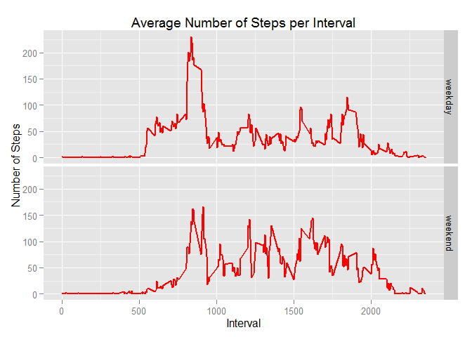

# Reproducible Research: Peer Assessment 1


## Loading and preprocessing the data
In keeping with the project instructions, the following code loads and provides the initial processing of the data.  


```r
if(!file.exists("./data")) {dir.create("./data")}

sourceFile <- "activity.zip"
if(file.exists(sourceFile)) { unzip(sourceFile, exdir="./data") }

outFile  <- "./data/activity.csv"
if (exists("DF") == FALSE) { DF <- read.csv(outFile) }
```

## What is mean total number of steps taken per day?
The distribution of the total number of steps per day is shown below.


```r
require(dplyr)
```

```
## Loading required package: dplyr
## 
## Attaching package: 'dplyr'
## 
## The following object is masked from 'package:stats':
## 
##     filter
## 
## The following objects are masked from 'package:base':
## 
##     intersect, setdiff, setequal, union
```

```r
require(ggplot2)
```

```
## Loading required package: ggplot2
```

```r
require(lubridate)
```

```
## Loading required package: lubridate
```

```r
ok <- complete.cases(DF)
df <- DF[ok,]
df$date <- ymd(df$date)

cdf <- aggregate(df$steps, by=list(df$date), sum)
names(cdf) <- c("Date","Steps")

g <- ggplot(cdf, aes(x = Date, y = Steps)) +
    geom_histogram(stat = "identity")
print(g)
```

 
The **mean** and **median** of the total number of steps per day are given below.


```r
summary(cdf)
```

```
##       Date                         Steps      
##  Min.   :2012-10-02 00:00:00   Min.   :   41  
##  1st Qu.:2012-10-16 00:00:00   1st Qu.: 8841  
##  Median :2012-10-29 00:00:00   Median :10765  
##  Mean   :2012-10-30 17:12:27   Mean   :10766  
##  3rd Qu.:2012-11-16 00:00:00   3rd Qu.:13294  
##  Max.   :2012-11-29 00:00:00   Max.   :21194
```

## What is the average daily activity pattern?


## Imputing missing values


## Are there differences in activity patterns between weekdays and weekends?
