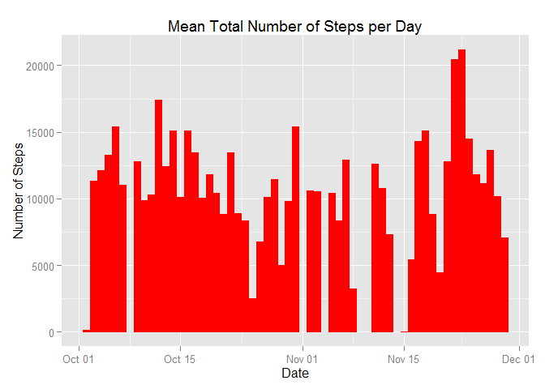
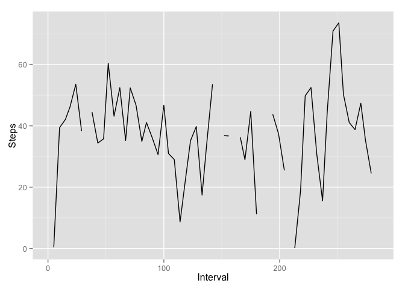

# Reproducible Research: Peer Assessment 1

The following libraries were used in this effort.


```r
options(scipen=1, digits=2)
require(dplyr)
```

```
## Loading required package: dplyr
## 
## Attaching package: 'dplyr'
## 
## The following object is masked from 'package:stats':
## 
##     filter
## 
## The following objects are masked from 'package:base':
## 
##     intersect, setdiff, setequal, union
```

```r
require(ggplot2)
```

```
## Loading required package: ggplot2
```

```r
require(lubridate)
```

```
## Loading required package: lubridate
```

```r
require(reshape2)
```

```
## Loading required package: reshape2
```

## Loading and preprocessing the data
> Show any code that is needed to...  
> 1. Load the data (i.e. read.csv())  
> 2. Process/transform the data (if necessary) into a format suitable for your analysis

In keeping with the project instructions, the following code loads and provides the initial processing of the data. In order to work with *interval* values across dates, I added a column to indicate the 


```r
if(!file.exists("./data")) {dir.create("./data")}
unzip("activity.zip", exdir="./data")
df <- read.csv("./data/activity.csv") 
idf <- df %>% group_by(interval) %>% mutate(ic = ntile(interval, 288))
```

## What is mean total number of steps taken per day?
> For this part of the assignment, you can ignore the missing values in the dataset.  
> 1. Calculate the total number of steps taken per day  
> 2. If you do not understand the difference between a histogram and a barplot, research the difference between them. Make a histogram of the total number of steps taken each day  
> 3. Calculate and report the mean and median of the total number of steps taken per day

The data were initially grouped by the *date* and the number of *steps* totalled for each day.  The resulting data were stored in a new data frame and the *date* column was changed from a factor to an date. The column names were changed for esthetic reasons.  

The distribution of the total number of steps per day is shown in the histogram below.


```r
cdf <- df %>% group_by(date) %>% summarise(steps = sum(steps))
cdf$date <- ymd(cdf$date)
names(cdf) <- c("Date","Steps")
g <- ggplot(cdf, aes(x = Date, y = Steps)) +
    geom_histogram(stat = "identity")
print(g)
```

 

```r
mn <- mean(cdf$Steps, na.rm = TRUE)
md <- median(cdf$Steps, na.rm = TRUE)
```

The analysis of the total number of steps per day showed the **mean** to be 10766.19 and the **median** to be 10765.

## What is the average daily activity pattern?
> 1. Make a time series plot (i.e. type = "l") of the 5-minute interval (x-axis) and the average number of steps taken, averaged across all days (y-axis)  
> 2. Which 5-minute interval, on average across all the days in the dataset, contains the maximum number of steps?

The following is a time series plot of the 5-minute interval (x-axis) and the average number of steps taken, averaged across all days (y-axis)

```r
sdf <- idf %>% group_by(ic) %>% summarise(istp = mean(steps))
names(sdf) <- c("Interval", "Steps")
g <- ggplot(sdf, aes(x = Interval, y = Steps)) +
    geom_line(stat = "identity")
print(g)
```

```
## Warning in loop_apply(n, do.ply): Removed 2 rows containing missing values
## (geom_path).
```

 

```r
mx <- sdf %>% arrange(desc(Steps)) %>% top_n(1) %>% select(Interval)
```

```
## Selecting by Steps
```
Interval 251 had the highest mean for number of steps.

## Imputing missing values
> Note that there are a number of days/intervals where there are missing values (coded as NA). The presence of missing days may introduce bias into some calculations or summaries of the data.  
> 1. Calculate and report the total number of missing values in the dataset (i.e. the total number of rows with NAs)  
> 2. Devise a strategy for filling in all of the missing values in the dataset. The strategy does not need to be sophisticated. For example, you could use the mean/median for that day, or the mean for that 5-minute interval, etc.  
> 3. Create a new dataset that is equal to the original dataset but with the missing data filled in.  
> 4. Make a histogram of the total number of steps taken each day and Calculate and report the mean and median total number of steps taken per day. Do these values differ from the estimates from the first part of the assignment? What is the impact of imputing missing data on the estimates of the total daily number of steps?


```r
na_cnt <- sum(is.na(df$steps))
```

There are 2304 intervals with no steps recorded. 


## Are there differences in activity patterns between weekdays and weekends?
> For this part the weekdays() function may be of some help here. Use the dataset with the filled-in missing values for this part.  
> 1. Create a new factor variable in the dataset with two levels – “weekday” and “weekend” indicating whether a given date is a weekday or weekend day.  
> 2. Make a panel plot containing a time series plot (i.e. type = "l") of the 5-minute interval (x-axis) and the average number of steps taken, averaged across all weekday days or weekend days (y-axis). See the README file in the GitHub repository to see an example of what this plot should look like using simulated data.


