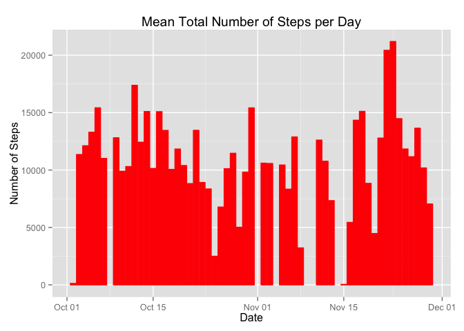
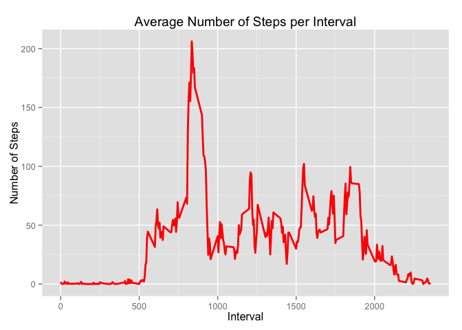
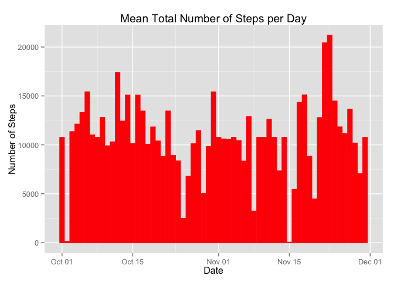

# Reproducible Research: Peer Assessment 1

The following libraries were used in this effort.


```r
options(scipen=1, digits=2)  # settings to control number formatting
require(dplyr)
require(ggplot2)
require(lubridate)
```

## Loading and preprocessing the data

```r
if(!file.exists("./data")) {dir.create("./data")}
unzip("activity.zip", exdir="./data")

# base data set with date column converted to date type
df <- read.csv("./data/activity.csv") 
df$date <- ymd(df$date)
```

## What is mean total number of steps taken per day?

The distribution of the mean total number of steps per day is shown in the histogram below.


```r
# data frame created for count by date
dte_df <- df %>% group_by(date) %>% summarise(steps = sum(steps))

# now plot the histogram
g1 <- ggplot(dte_df, aes(x = date, y = steps)) +
    geom_histogram(stat = "identity", fill = "red", colour = "red") +
    ggtitle("Mean Total Number of Steps per Day") +
    xlab("Date") +
    ylab("Number of Steps")
print(g1)
```

 

```r
# find mean and median for number of steps
dy_mn <- mean(dte_df$steps, na.rm = TRUE)
dy_md <- median(dte_df$steps, na.rm = TRUE)
dy_sd <- sd(dte_df$steps, na.rm = TRUE)
```

The analysis of the total number of steps per day showed the **mean** to be 10766.19  (with a standard deviation of 4269.18) and the **median** to be 10765.

## What is the average daily activity pattern?

The following is a time series plot of the 5-minute interval (x-axis) and the average number of steps taken, averaged across all days (y-axis).


```r
#  data frame created to average steps by interval
intv_df <- df %>% group_by(interval) %>% summarise(steps = mean(steps, na.rm = TRUE))

# now plot the time series
g2 <- ggplot(intv_df, aes(x = interval, y = steps)) +
    geom_line(stat = "identity", colour = "red", size = 1) +
    ggtitle("Average Number of Steps per Interval") +
    xlab("Interval") +
    ylab("Number of Steps")
print(g2)
```

 

```r
# find interval with highest average number of steps
intv_mx <- intv_df %>% arrange(desc(steps)) %>% top_n(1) %>% select(interval)
```

```
## Selecting by steps
```

Interval 835 had the highest mean for number of steps.


## Imputing missing values


```r
# determines number of NA in the base data frame
na_cnt <- sum(is.na(df$steps))
```

There are 2304 intervals with no steps recorded. When these are replaced with the overall mean for that interval, the following is seen.


```r
#  data frame created with imputed NA data frame
#  --- first add a new column with the interval mean

na_df <- df %>% group_by(interval) %>% mutate(mstep = mean(steps, na.rm = TRUE))

#  --- now assign interval mean instead of NA
na_df$steps <- ifelse(is.na(na_df$steps), na_df$mstep, na_df$steps)

#  --- resulting data frame for average steps by interval
nona_df <- na_df %>% group_by(date) %>% summarise(steps = sum(steps))

# now plot the histogram
g3 <- ggplot(nona_df, aes(x = date, y = steps)) +
    geom_histogram(stat = "identity", fill = "red", colour = "red") +
    ggtitle("Mean Total Number of Steps per Day") +
    xlab("Date") +
    ylab("Number of Steps")
print(g3)
```

 

```r
# determines the mean and median
na_mn <- mean(nona_df$steps)
na_md <- median(nona_df$steps)
na_sd <- sd(nona_df$steps)
```

The analysis of the total number of steps per day with imputed values for NA showed the **mean** to be 10766.19 (with a standard deviation of 3974.39) and the **median** to be 10766.19.


## Are there differences in activity patterns between weekdays and weekends?


```r
# data frame created for weekend to weekday comparison
# --- Weekend factor added to base data frame
wk_df <- na_df %>%
    mutate(weekend = ifelse(weekdays(date, abbreviate = TRUE) %in% c("Sun","Sat"), 
                            "weekend",
                            "weekday"))
wk_df$weekend <- as.factor(wk_df$weekend)

# --- resulting data from with average steps per weekend or weekday interval
wk_df <- wk_df %>% group_by(weekend, interval) %>% summarise(steps = mean(steps, na.rm = TRUE))

# now plot the time series
g4 <- ggplot(wk_df, aes(x = interval, y = steps)) +
    geom_line(stat = "identity", colour = "red", size = 1) +
    facet_grid(weekend ~ .) +
    ggtitle("Average Number of Steps per Interval") +
    xlab("Interval") +
    ylab("Number of Steps")
print(g4)
```

 
